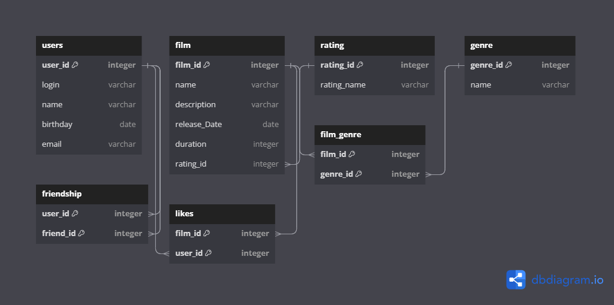

# Filmorate Application 🎥

## Description
Filmorate - веб-приложение, в котором можно ставить оценки фильмам и выбирать кино на основе оценок других пользователей.

## Tech Stack 🔧
[](https://www.oracle.com/java/) [](https://spring.io/projects/spring-framework) [](https://docs.oracle.com/javase/tutorial/jdbc/overview/index.html) [](https://www.h2database.com/html/main.html) [](https://junit.org/junit5/docs/current/user-guide/)
[](https://maven.apache.org/) [](https://swagger.io/)

## How to set up the project ▶

1) Склонируйте репозиторий и перейдите в него
```
git clone https://github.com/Antroverden/java-filmorate.git
```
2) Запустите проект в выбранной IDE

3) Перейдите по адресу
```
http://localhost:8080
```
4) Можно работать с проектом


## Filmorate API ⚙️:
Примеры HTTP-запросов к контроллерам при запущенном приложении можно увидеть по ссылке:
```
http://localhost:8080/swagger-ui/index.html
```


## Database schema:

